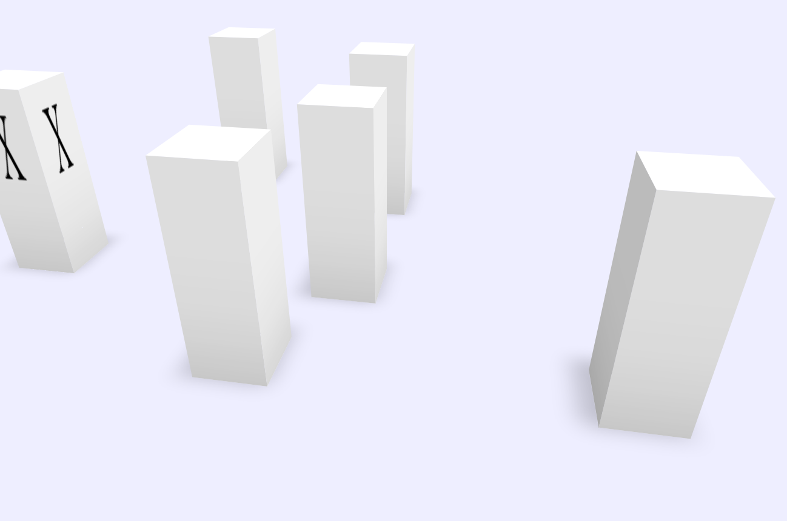

# CSSity3D
Just a small test I created to learn about CSS 3D transforms.

Renders a set of "skyscrapers" (rotating slowly) without using any JavaScript. 

[Click here for the demo ](http://olydis.github.io/CSSity3D/)
